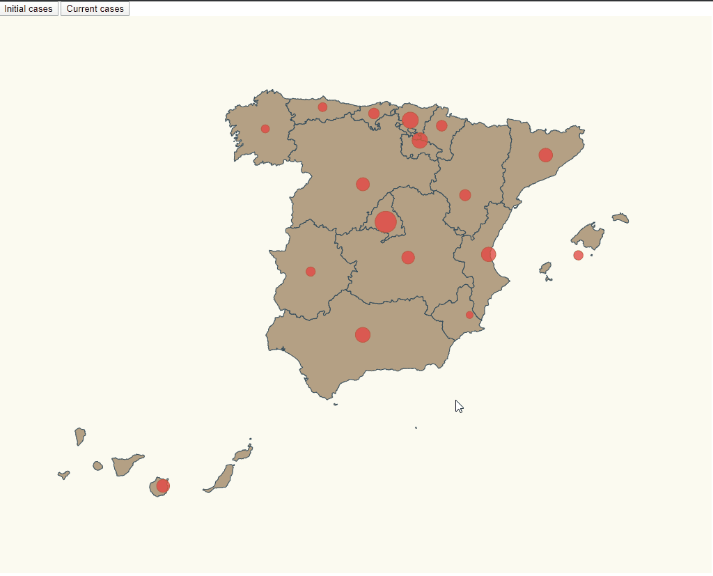

# Rendering map
The objective is using 02-pin-location-scale to change the circles of each community in function of the number of cases of covid using two buttons to select the initial data of covid cases or current data




# Steps

- I take as starting example 02-pin-location-scale from https://github.com/Lemoncode/d3js-typescript-examples/tree/master/02-maps 

_./src/index.html_

Two button were added to the index page

```diff
<html>
  <head>
    <link rel="stylesheet" type="text/css" href="./map.css" />
    <link rel="stylesheet" type="text/css" href="./base.css" />
  </head>
  <body>
+   <div>
+    <button id="initial">Initial cases</button>
+    <button id="current">Current cases</button>
+  </div>
    <script src="./index.ts"></script>
  </body>
</html>
```


_./src/map.css_

Country class was renamed to community and some colours were changed

```diff
-.country {
+.community {
   stroke-width: 1;
   stroke: #2f4858;
-  fill: #008c86;
+  fill: #b4a185;
}
.affected-marker {
   stroke-width: 1;
   stroke: #bc5b40;
-  fill: #f88f70;
+  fill: #e93b3b;
   fill-opacity: 0.7;
}
```
_./src/spain.json_
_./src/communities.ts_
_./src/stats.ts_

All names were checked to be the same in the 3 files, all accents were deleted and the letter 'ñ' from cataluña was changed to 'ny' being catalunya the new name. This was do in order to avoid all possible fails due to the language

_./src/stats.ts_

A interface was added to be the interface for initial data and current data of covid cases
```diff
+export interface ResultEntry {
+  name: string;
+  value: number;
+}
```
_./src/stats.ts_

Const stats was changed to add the ResultEntry interface
```diff
+export const stats: ResultEntry[] = [
-export const stats = [
```
_./src/stats.ts_

Const statsUpdated was added with the current data of covid cases
```diff
+export const statsUpdated: ResultEntry[] = [
+    {
+      name: "Madrid",
+      value: 44783
+    },
+    {
+      name: "La Rioja",
+      value: 3076
+    },
+    {
+      name: "Andalucia",
+      value: 9510
+    },
+    {
+      name: "Catalunya",
+      value: 31824
+    },
+    {
+      name: "Valencia",
+      value: 8331
+    },
+    {
+      name: "Murcia",
+      value: 1383
+    },
+    {
+      name: "Extremadura",
+      value: 2332
+    },
+    {
+      name: "Castilla La Mancha",
+      value: 13063
+    },
+    {
+      name: "Pais Vasco",
+      value: 10103
+    },
+    {
+      name: "Cantabria",
+      value: 1659
+    },
+    {
+      name: "Asturias",
+      value: 1799
+    },
+    {
+      name: "Galicia",
+      value: 6946
+    },
+    {
+      name: "Aragon",
+      value: 3831
+    },
+    {
+      name: "Castilla y Leon",
+      value: 11102
+    },
+    {
+      name: "Islas Canarias",
+      value: 1858
+    },
+    {
+      name: "Islas Baleares",
+      value: 1488
+    },
+    {
+      name:"Navarra",
+      value:3748
+    }
+  ];
```

_./index.ts_
On the imports part the change was that is necessary to add the import of statsUpdated and ResultEntry
```diff
 import * as d3 from "d3";
 import * as topojson from "topojson-client";
 const spainjson = require("./spain.json");
+import { stats, statsUpdated, ResultEntry } from "./stats";
 const d3Composite = require("d3-composite-projections");
 import { latLongCommunities } from "./communities";
-import { stats } from "./stats";
```

_./index.ts_
All relationed to the creation and fill of the circles in the map were grouped in const createSvg and some part were changed
```diff
-const maxAffected = stats.reduce(
-  (max, item) => (item.value > max ? item.value : max),
-  0
-);
-
-const affectedRadiusScale = d3
-  .scaleLinear()
-  .domain([0, maxAffected])
-  .range([0, 50]); // 50 pixel max radius, we could calculate it relative to width and height
+const createSvg=(data:ResultEntry[])=>{
   
+   const affectedRadiusScaleQuantile=d3
+   .scaleLinear()
+   .domain([0,15,50,100,1000,5000,10000,40000])
+   .range([5,9,12,15,18,21,25,30,40])

    const calculateRadiusBasedOnAffectedCases = (comunidad: string) => {
      const entry = data.find(item => item.name === comunidad);
+     return entry ? affectedRadiusScaleQuantile(entry.value) : 0;    
-      return entry ? affectedRadiusScale(entry.value) : 0;
    };

+      const circles=svg
+      .selectAll("circle");
+      circles
-      svg
-      .selectAll("circle")
      .data(latLongCommunities)
      .enter()
      .append("circle")
      .attr("class","affected-marker")
      .attr("r", d=>calculateRadiusBasedOnAffectedCases(d.name))
      .attr("cx",d=> aProjection([d.long,d.lat])[0])
      .attr("cy",d=> aProjection([d.long,d.lat])[1])
+     .merge(circles as any)
+     .transition()
+     .duration(500)
+     .attr("r", d=>calculateRadiusBasedOnAffectedCases(d.name));
+ };
```
_./index.ts_
Using the buttons of the index.html I added an event listener to update the map when a button is clicked
```diff
+ document
+  .getElementById("current")
+  .addEventListener("click", function handleCurrent() {
+    createSvg(statsUpdated);
+  });
+  document
+  .getElementById("initial")
+  .addEventListener("click", function handleInitial() {
+    createSvg(stats);
+  });
```

